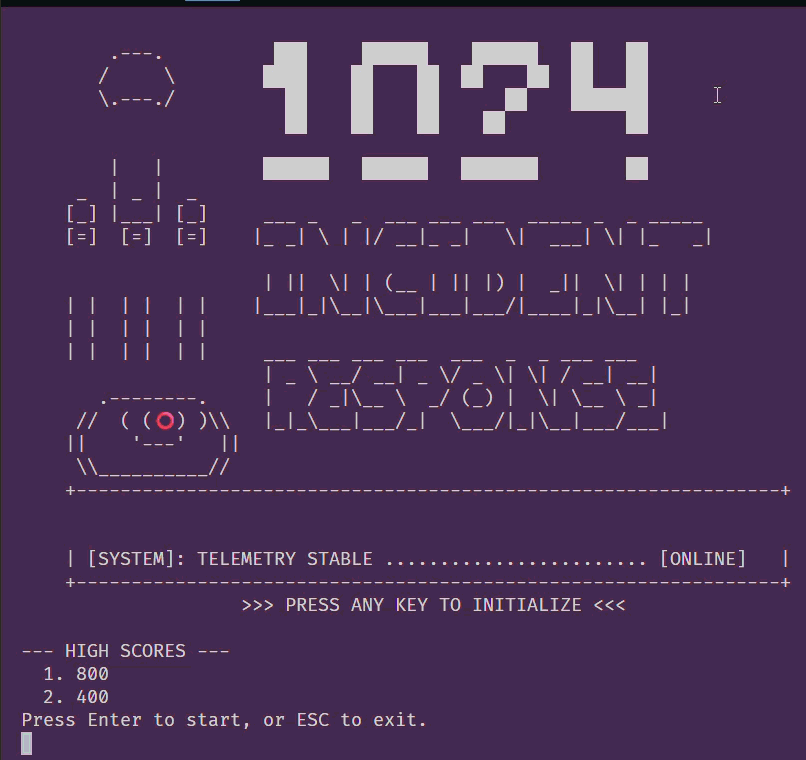

# 🎮 Cloud Reaction Game

[](https://github.com/jpanderson91/reaction-game/actions/workflows/build.yml)
[](https://github.com/jpanderson91/reaction-game/actions/workflows/tests.yml)


> A terminal-based reaction-time game that simulates real-world cloud incidents (CPU spikes, PROD down, latency alerts) with console art and text effects.

---

## ✨ Demo




---

## 🚀 Why this project exists

This is a *portfolio-quality* learning project that demonstrates:

- **Core Python fundamentals** (loops, conditionals, functions, timing, randomness)
- **Terminal UI polish** (ASCII art, colors, screen-clears/animations)
- **Game loop design** (rounds, streaks, difficulty scaling, fake-outs)
- **Professional hygiene** (tests + GitHub Actions CI with status badges)

---

## 🎯 Gameplay

1. An animated start screen displays with high scores and stats.
2. An engineer sits at their desk (animated wait screen) while a random delay counts down.
3. An incident fires with flashing alerts: `🚨 PROD DOWN` / `🔥 CPU SPIKE` / `⏱️ LATENCY`
4. You must press the correct random key as fast as possible to resolve it.
5. Success earns points (base + speed bonus + streak multiplier). Wrong key = lose a life.
6. If you're too slow (30% chance), the incident escalates into a math problem you must solve.
7. Solving the escalation earns bonus points and an extra life.
8. Lose all 3 lives and it's game over — your score is saved to the leaderboard.

---

## ✅ Features

- [x] One-round reaction timer (MVP)
- [x] Multiple incidents + randomized prompts
- [x] ANSI colors + ASCII banners
- [x] Multi-round sessions, streaks, best times
- [x] Escalation mechanic (math problems if too slow)
- [x] Difficulty scaling (math problems get harder every 10 rounds)
- [x] Lives system (3 lives, game over at 0)
- [x] Scoring: base points + speed bonus + 3x streak multiplier
- [x] Animated screens (start, wait, alert, success, fail, game over)
- [x] Persist high scores (top 5 leaderboard)

---

## 🧱 Roadmap (phased rubric)

### Phase 0 — Setup
- [x] Create project & run `python main.py`
- [x] Add dependencies (optional)

### Phase 1 — MVP (vertical slice)
- [x] WAIT → random delay → GO → measure reaction time

### Phase 2 — Cloud theme
- [x] Alerts: CPU spike / PROD down / latency

### Phase 3 — Visual polish
- [x] Colors + ASCII art + screen clearing

### Phase 4 — Game loop
- [x] Multi-round session + score tracking

### Phase 5 — Mechanics
- [x] Fake-outs + penalties + streak system

### Phase 6 — Polish
- [x] Animated screens for all game states (start, wait, alert, success, fail, game over)

### Phase 7 — Persistence
- [x] Save/load top 5 highscores to JSON

---

## 🧩 Tech stack

- **Python 3.x**
- Optional terminal helpers:
  - `colorama` (cross-platform colors)
  - `pyfiglet` (ASCII banners)
- Testing:
  - `pytest`
- CI:
  - GitHub Actions workflows in `.github/workflows/`

---

## 📂 Project structure

```
reaction-game/
│
├── main.py
├── game/
│   ├── scoring.py
│   ├── escalation.py
│   └── highscores.py
├── ui/
│   ├── ascii_art.py
│   ├── animations.py
│   └── incident_art.py
├── events/
│   └── alerts.py
├── data/
│   └── highscores.json
├── tests/
│   └── test_smoke.py
├── docs/
│   └── images/
│       └── finished-game-loop-small.gif
├── requirements.txt
└── README.md
```

---

## 🏁 Getting started

### Run locally

```bash
python main.py
```

### Install optional dependencies

```bash
pip install -r requirements.txt
```

### Install dev dependencies (tests)

```bash
pip install -r requirements-dev.txt
```

### Run tests

```bash
pytest -q
```

---

## 🤖 AI mentor workflow (recommended)

If you're using an AI agent, keep it in *mentor mode*:
- Ask questions first
- Share small hints
- Avoid big code dumps

(You can keep your Socratic system prompt in `docs/ai-system-prompt.md` if you want it versioned.)

---

## 🧷 CI badges (make them live)

These badges auto-update when the workflows run:

- `build.yml` → build/sanity checks
- `tests.yml` → unit tests

**Important:** Replace `jpanderson91` and `reaction-game` at the top of this README with your GitHub username/org and repository name.

---

## 📜 License

MIT (or choose your preferred license).
